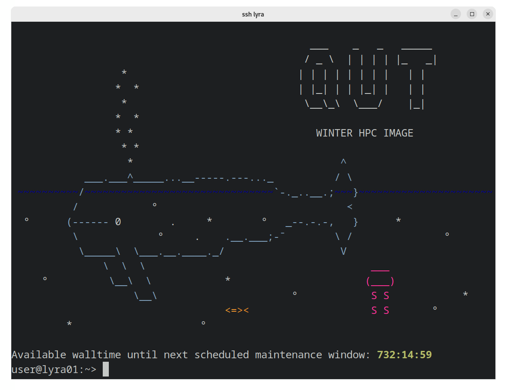
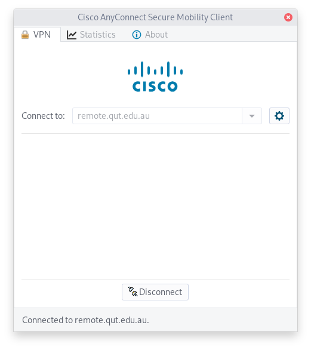
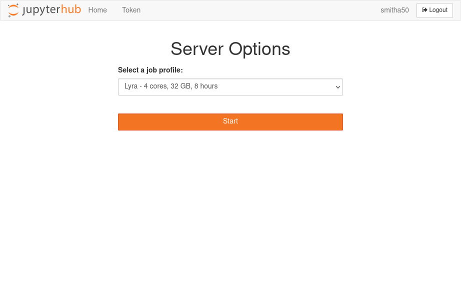

import Tabs from '@theme/Tabs';
import TabItem from '@theme/TabItem';


# Connecting to Lyra



Most users connect to Lyra using an [SSH](https://en.wikipedia.org/wiki/Secure_Shell) client, typically with a terminal emulator.


:::info External access

To connect to Lyra from outside QUT's network, use the VPN at [remote.qut.edu.au](https://remote.qut.edu.au/).

:::

## Apply for HPC access

Submit the [HPC Account Request form](https://heat2.qut.edu.au/HEAT/Login.aspx?ProviderName=QUT+SAML&Role=SelfService&Scope=SelfService&CommandId=NewServiceRequestByOfferingId&Tab=ServiceCatalog&Template=0E927692EA94478D8AC652F3A917548F)

## SSH

<Tabs groupId="operating-systems">
<TabItem value="win" label="Windows">

:::caution Enabling the SSH feature

You may need to enable the [ssh feature](https://learn.microsoft.com/en-us/windows/terminal/tutorials/ssh) in Windows.

:::

In a Windows Terminal, Powershell, or cmd.exe, run the following command:

```bash
ssh qutusername@lyra.qut.edu.au
```

or 

```bash
ssh qutusername@lyra
```

:::tip

On Windows, use the [Windows Terminal](https://github.com/microsoft/terminal) for the best experience.

:::
</TabItem>
<TabItem value="mac" label="macOS">
In a terminal emulator, run the following command:

```bash
ssh qutusername@lyra.qut.edu.au
```

or 

```bash
ssh qutusername@lyra
```
</TabItem>
<TabItem value="linux" label="Linux">
In a terminal emulator, run the following command:

```bash
ssh qutusername@lyra.qut.edu.au
```

or 

```bash
ssh qutusername@lyra
```        
</TabItem>
</Tabs>


### Public-key authentication

To connect to Lyra without entering your password, use public-key authentication:

:::tip Create key-pair

If you don't already have a public key, create a public-private key-pair using ssh-keygen:

```bash
ssh-keygen
```

```
$ ssh-keygen
Enter file in which to save the key (/home/user/.ssh/id_rsa): 
Created directory '/home/user/.ssh'.
Enter passphrase (empty for no passphrase): 
Enter same passphrase again: 
Your identification has been saved in /home/user/.ssh/id_rsa
Your public key has been saved in /home/user/.ssh/id_rsa.pub
The key fingerprint is:
SHA256:C9UFkXqeAqzDxVUaGVWI13ESBvnmvWQX41w5FuUFbcM user@pc
The key's randomart image is:
+---[RSA 3072]----+
|        o**XBo+o+|
|        ++=o.o E+|
|     o .oo..   .=|
|      =.. . o  *.|
|   . o..So + .+ =|
|    +  ...o . +o.|
|     .  ..   o o |
|              .  |
|                 |
+----[SHA256]-----+
```

:::

```bash
ssh-copy-id qutusername@lyra.qut.edu.au
```

### Saved hosts

To connect to Lyra without entering your username, create a new Host in `~/.ssh/config`:

```config title="~/.ssh/config"
Host lyra
    User qutusername
    Hostname lyra.qut.edu.au
```

Then connect to the host:

```
ssh lyra
```


## VPN

Navigate to [remote.qut.edu.au](https://remote.qut.edu.au) and follow the instructions to install Cisco Anyconnect

<div style={{ textAlign: 'center' }}>



</div>

## JupyterHub

:::note Connecting to JupyterHub
See [JupyterHub](../../../jupyterhub/index.md) to read about how JupyterHub on Lyra works.
:::

Navigate to [jupyterhub.eres.qut.edu.au](https://jupyterhub.eres.qut.edu.au) to use JupyterHub to access Lyra.



## HPC-FS