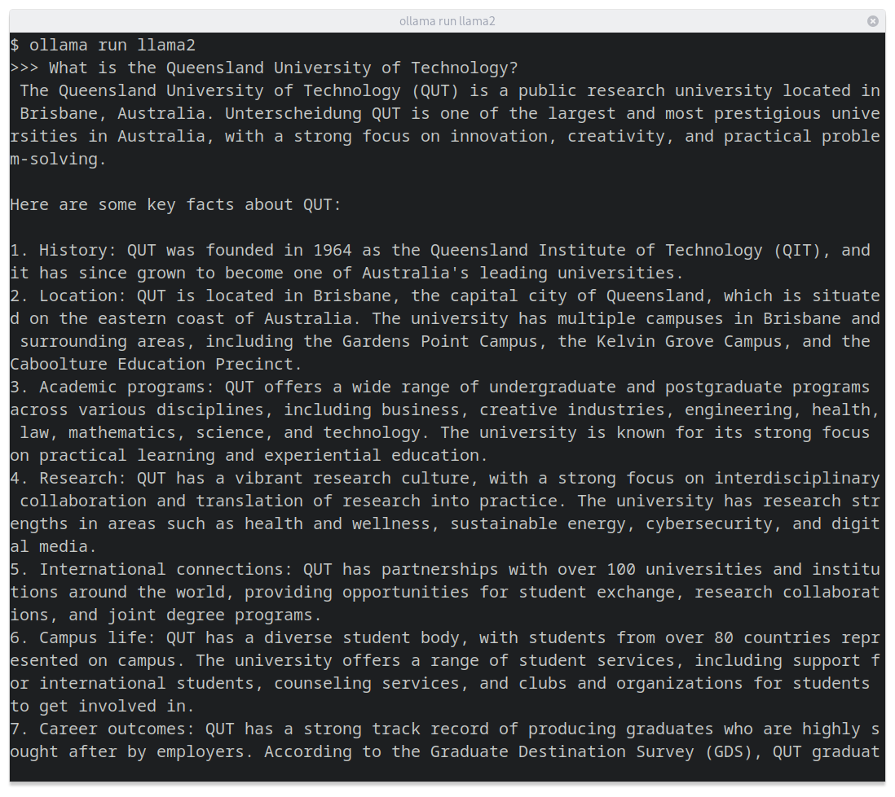

# Chat

Large Language Models (LLMs) like GPT-n from OpenAI, or Llama from Meta have been trained to generate text. We can use versions of these models that have been fine-tuned to act as chatbots, allowing you to interact with said models in a conversational style.

:::note

See also: [Completion](../completion/index.mdx)

:::

## Gradio pipeline

import HuggingFacePipeline from '@site/src/components/tool/guide/HuggingFacePipeline/HuggingFacePipeline';

<HuggingFacePipeline
    title="Text Generation"
    link="https://huggingface.co/tasks/text-generation"
    task="text-generation"
    presets={
        [
            {
                name: "Mixtral-8x7B-Instruct on Lyra with an A100 GPU",
                model: "/work/models/mistral/Mixtral-8x7B-Instruct-v0.1",
                config: {
                    service: "Lyra",
                    hardware: "GPU",
                    cpuVendor: "Any",
                    cpuCores: 8,
                    ram: 32,
                    gpuVendor: "NVIDIA",
                    gpuModel: "A100",
                    gpuModules: 1,
                    tool: "CLI",
                    environment: "Singularity"
                }
            },
            {
                name: "Llama-2-7b-chat on Lyra with an A100 GPU",
                model: "/work/models/llama/llama-2/llama-2-7b-chat-hf",
                config: {
                    service: "Lyra",
                    hardware: "GPU",
                    cpuVendor: "Any",
                    cpuCores: 8,
                    ram: 32,
                    gpuVendor: "NVIDIA",
                    gpuModel: "A100",
                    gpuModules: 1,
                    tool: "CLI",
                    environment: "Singularity"
                }
            },
            {
                name: "Llama-2-7b-chat locally",
                model: "meta-llama/Llama-2-7b-chat-hf",
                config: {
                    service: "Local",
                    os: "Linux",
                    hardware: "GPU",
                    tool: "CLI",
                    environment: "Singularity"
                }
            },
            {
                name: 'Bloom on Lyra with an A100 GPU',
                model: "bigscience/bloom",
                config: {
                    service: "Lyra",
                    hardware: "GPU",
                    cpuVendor: "Any",
                    cpuCores: 4,
                    ram: 16,
                    gpuVendor: "NVIDIA",
                    gpuModel: "A100",
                    gpuModules: 1,
                    tool: "CLI",
                    environment: "Singularity"
                }
            }
        ]   }
/>

## text-generation-webui

[text-generation-webui](https://github.com/oobabooga/text-generation-webui) is a popular web interface to interact with Large Language Models.

## Ollama

[Ollama](https://github.com/jmorganca/ollama) is a CLI tool for interacting with Large Language Models.

