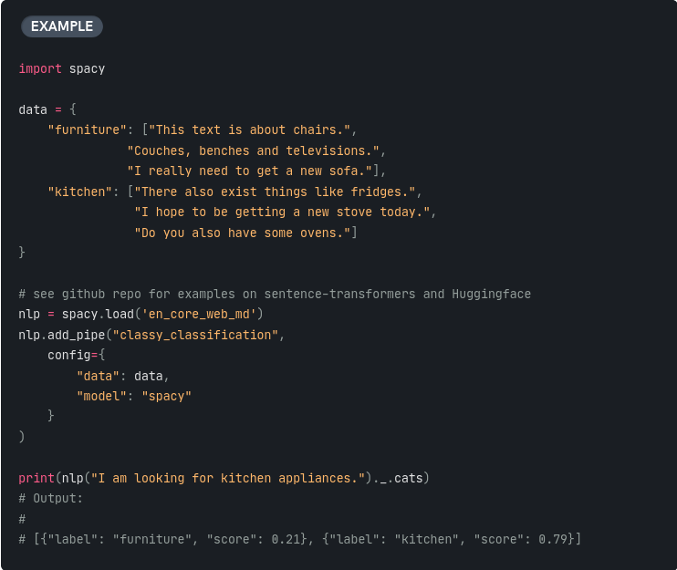

# Classification

Text classification assigns two or more categories to text according to its content.

## spaCy

[spaCy](https://spacy.io/) is a library & CLI for performing general Natural Language Processing tasks, including text classification

## huggingface pipeline

[text classification](https://huggingface.co/tasks/text-classification)

[sentiment-analysis](https://huggingface.co/docs/transformers/tasks/sequence_classification#inference)

[named entity recognition](https://huggingface.co/docs/transformers/tasks/token_classification#inference)

## fastText

[fastText](https://fasttext.cc/) is a library for efficient learning of word representations and sentence classification.