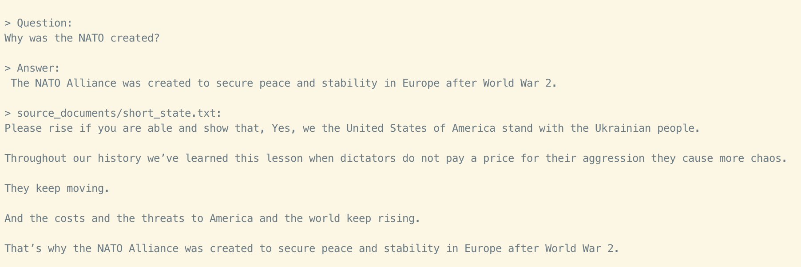

# Semantic Search

Semantic search is used to query a corpus of documents in order to find information.

## privateGPT

[privateGPT](https://github.com/imartinez/privateGPT) is a popular CLI tool for semantic indexing and question-answering of text documents.

## Sentence Transformers

[Sentence Transformers](https://www.sbert.net/) is a Python framework for creating text embeddings.

## Gradio pipeline

[question answering](https://huggingface.co/tasks/question-answering)